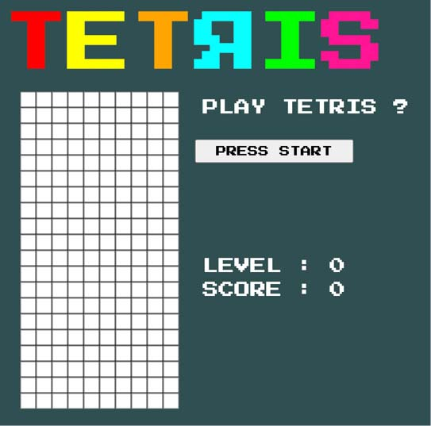
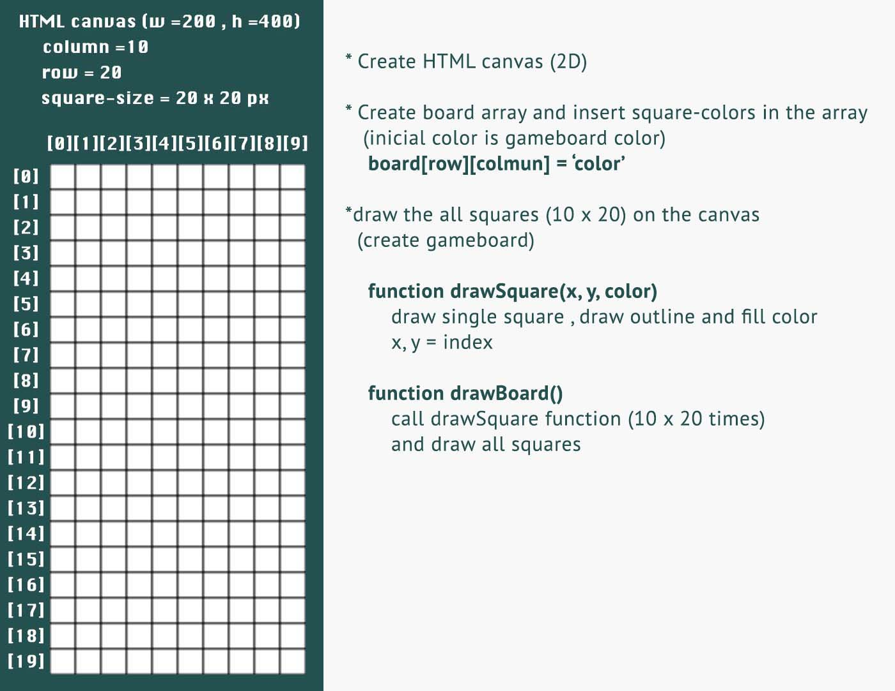
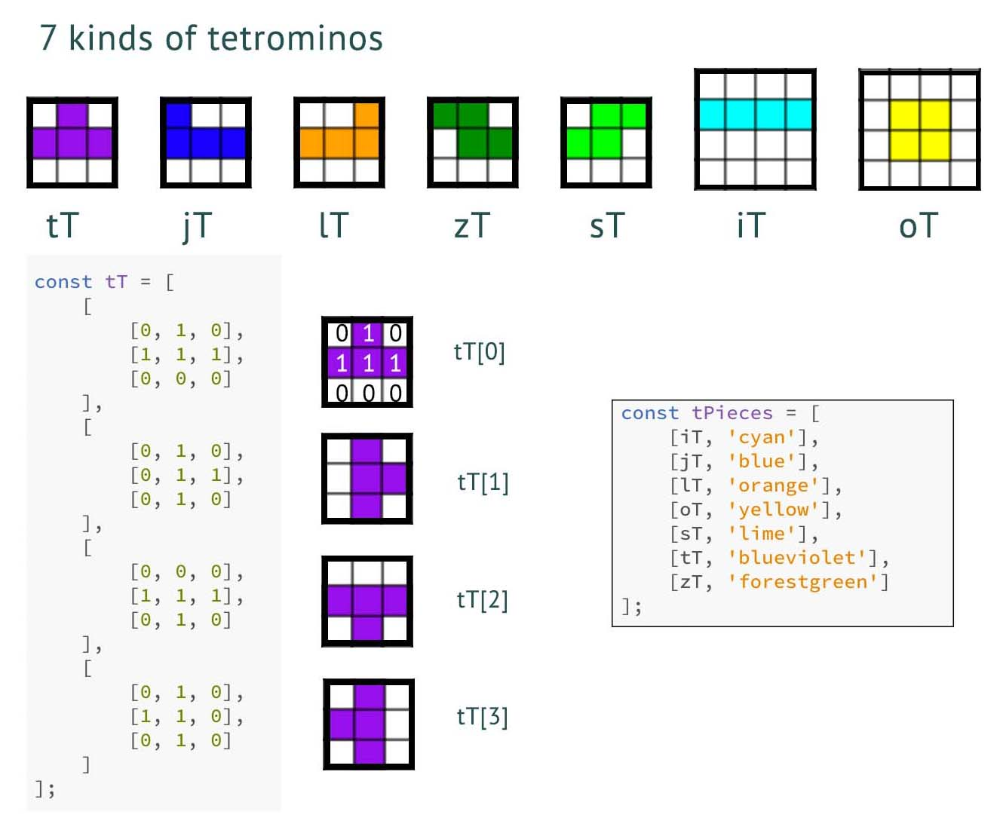
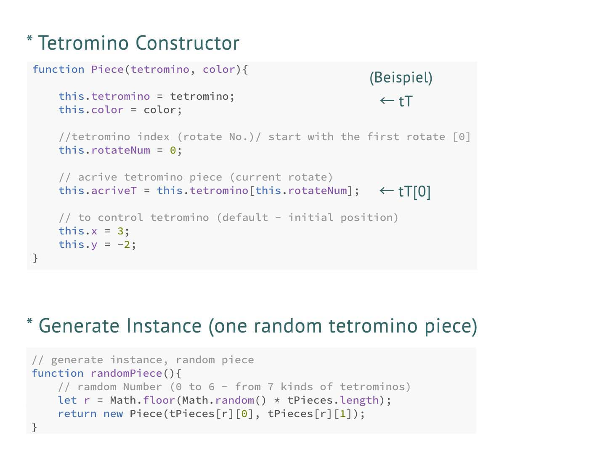
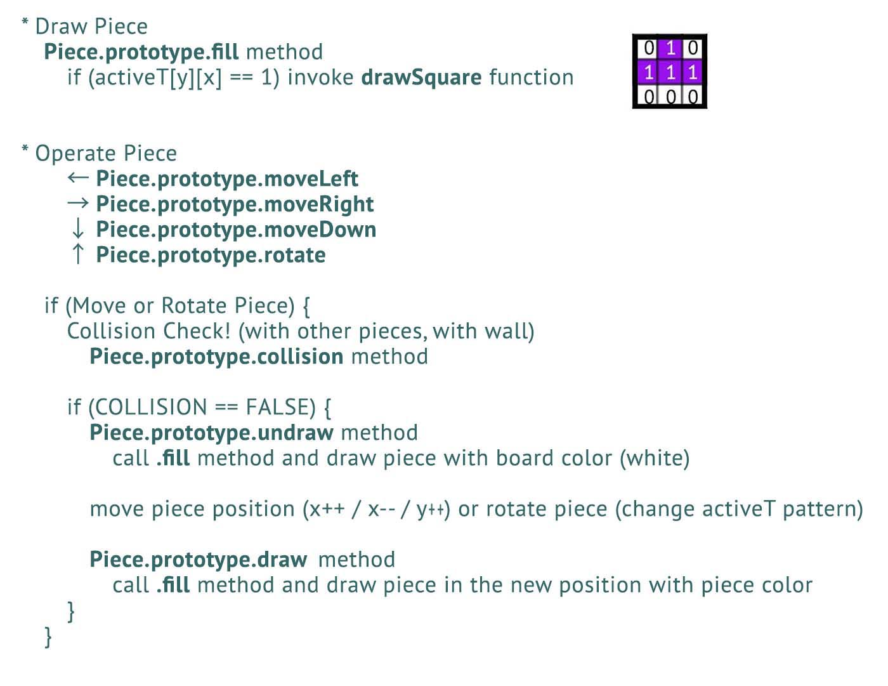
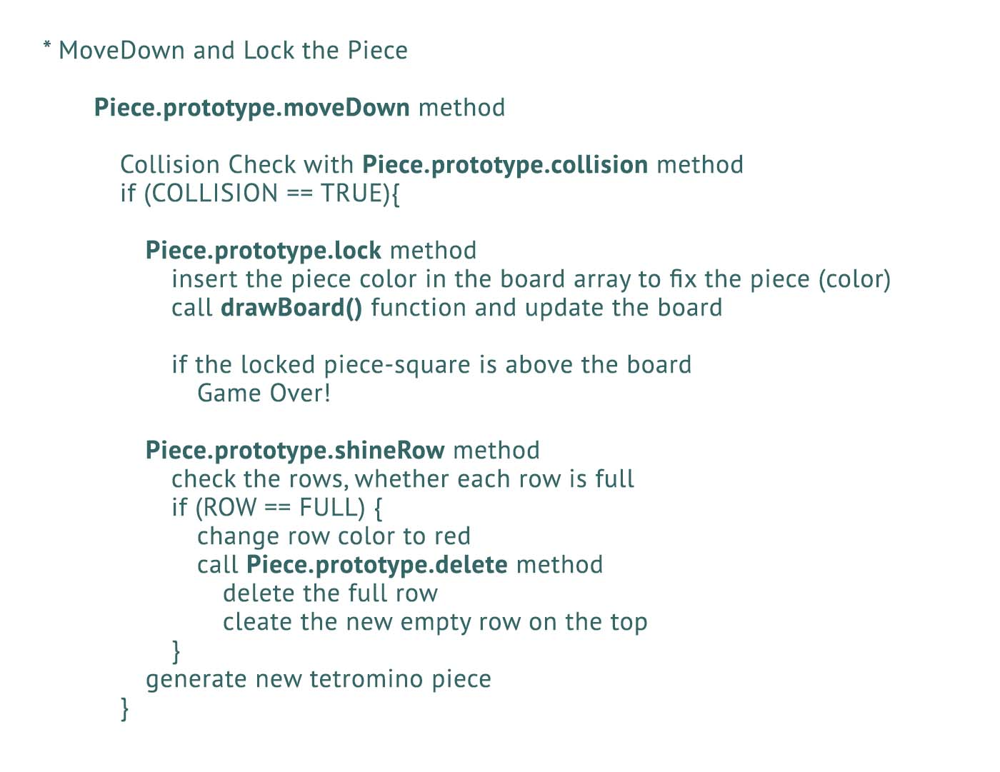
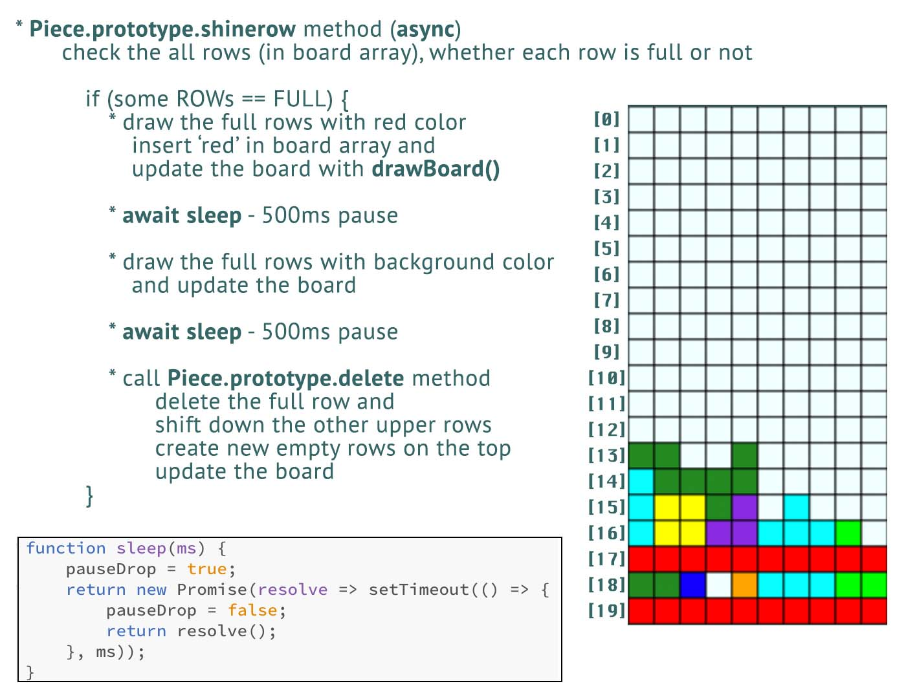

# MY TETRIS JS

### Link to the game: [https://stackblitz.com/edit/naomix-tetris](https://stackblitz.com/edit/naomix-tetris)

## About The Project

Tetris ist ein beliebtes Puzzle-Game, das im 1980er Jahren in Russland geboren ist.  
Ich bin selbst eine Tetris-Fan. In meiner Kindheit habe ich GAMEBOY-Tetris so viel gespielt.
Also, als ich ein Spiel mit JavaScript entwickeln wollte, hat mir Tetris eingefallen. 

Viele Entwickler haben mit verschiedenen Arten die Tetris-Kopien entwickelt und bekannt gemacht. Von solchen Entwickrungen habe ich gute Tipps bekommen und dann mein originales Tetris entwickelt.  

### UI

Das Konzept von UI ist retrospektiv.  
Der Font "Press Start 2P", der im diesen Spiel benutzt wird, ist ein Bitmap-Font, der auf dem Font der Namco-Games im 1980er Jahren basiert. Damit beabsichtige ich, ein Retro-Games wiederzugeben. Das Retro-UI erinnert uns an alte gute Retro-Games...

## Technologies Used 

* HTML5
* CSS3
* JavaScript
* [Google Fonts (Press Start 2P)](https://fonts.google.com/specimen/Press+Start+2P)

## Gameplay

Das Spiel ist nur für Desktop-PC.  
Drücken Sie den "PRESS START" Button, um das Spiel zu starten.  
Das Spiel hat keine Pausen-Funktion.  
Verwenden Sie  die Pfeiltasten zum Bewegen und Drehen der Tetromino-Pieces.

* &larr; Move Left
* &rarr; Move Right
* &darr; Move Down
* &uarr; Rotate              

Eine einzelne Linie-Löschung ist 10 Punkte wert. Wenn Sie mehrere Zeilen gleichzeitig löschen (Combo), können Sie Bonuspunkte verdienen.  
Das Spiellevel steigt jedes Mal, wenn Sie 100 Punkte erhalten. Die Geschwindigkeit der fallenden Tetrominos steigt mit jedem Level.

## Implementation

### Create Gameboard 
 

### Generate Tetromino-Pieces
 
 

### Draw, Move and Rotate the Piece
 

### Move Down and Lock the Piece 
 

### Change Row Color and Delete the Full Row
 

## Roadmap

See the [issues](https://github.com/nao-mix/tetris/issues) for a list of proposed features.

## License

Distributed under the MIT License. See `LICENSE` for more information.

## Contact

naomix - [AUF DER REISE](https://aufderreise.com/) - info@aufderreise.com

